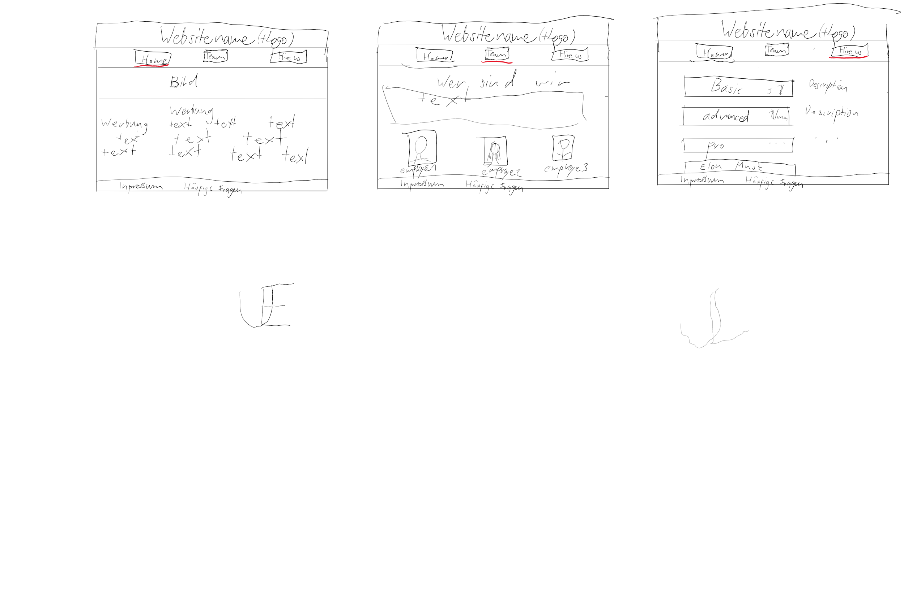
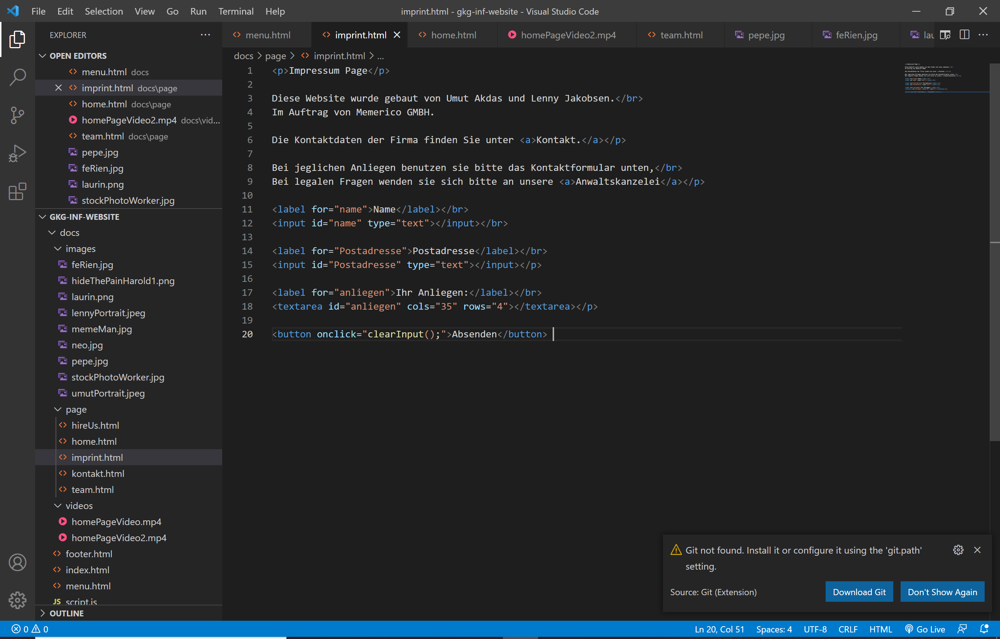
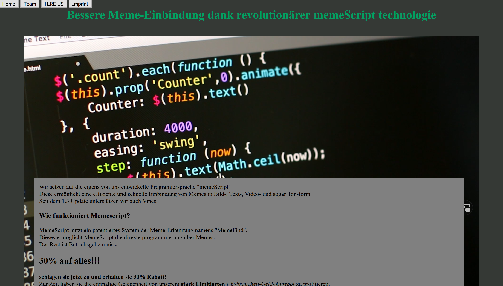
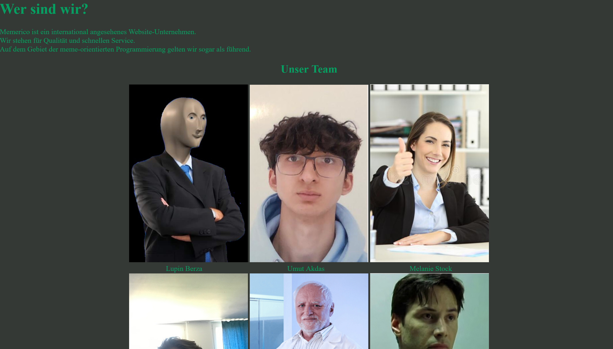
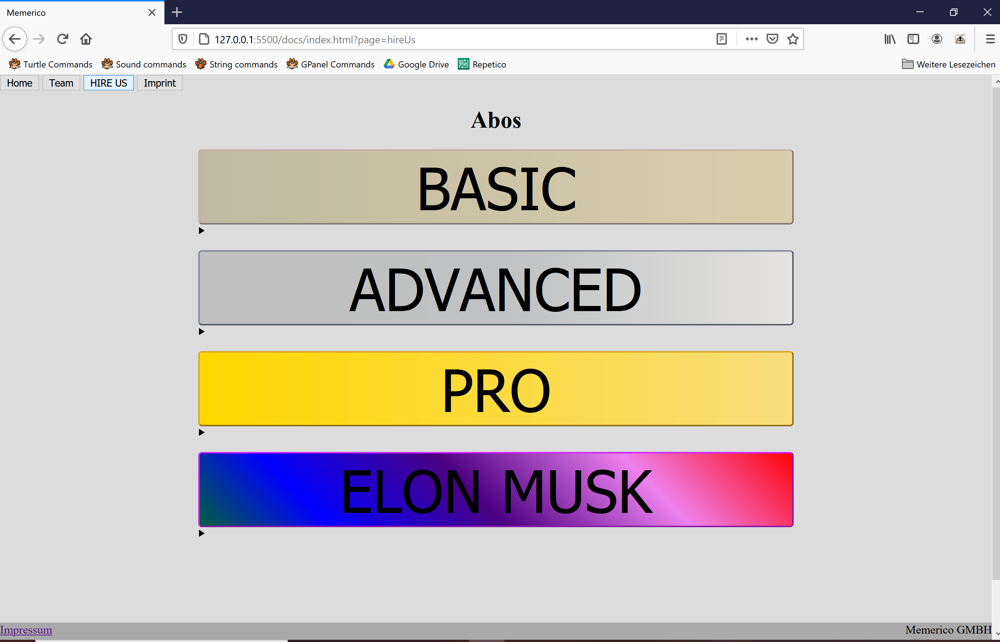
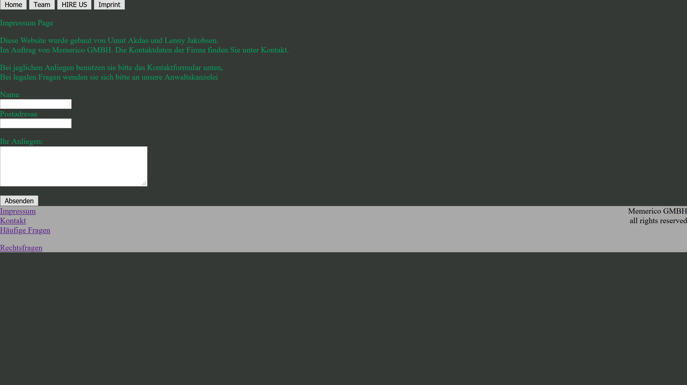

# Dokumentation Informatik

## Unser Projekt: 

Bei unserem Projekt geht es grundlegend um eine Website, die für Websites wirbt und diese auch erstellt. Unsere Website soll den Besuchern eine breite Auswahl an Möglichkeiten bieten, denn diese haben freie Wahl zwischen einer von unseren 4 Angeboten. Die Farbwahl ist an "*Matrix*" angelehnt um an alten Code zu erinnern. Das ganze Projekt wurde von uns eher witzig gehalten, denn wir wollten viele Memes einbauen, welche für ein Ansehnliches Bild sorgen.

## Zeitplan und Entwürfe:

In der ersten Schullektion haben wir noch nicht sehr viel gemacht, denn wir hatten nur Zeit um uns mit dem Planen der Website zu beschäftigen. Wir haben Skizzen angefertigt, welche sie hier sehen:

Bei unserer Website haben wir uns ziemlich genau an die Skizzen gehalten und der einzige Unterschied lag beim Impressum, denn für diesen haben wir eine einzelne Unterseite erstellt. Die Website soll das Team, welches dahinter steckt und auch die Kaufmöglichkeiten aufzeigen.

Ausserdem haben wir einen Zeitplan erstellt für unser weiteres Verfahren. Diesen Zeitplan sehen sie hier:

3 Mai: *Projektplanung*

10 Mai: *Erste versuche, Text, Hauptseite*

17 Mai: *Hauptseite, Unterseiten, Text, Abschluss*

24 Mai: *Frei*

## Unsere Website:

### Home
Unsere Home-Seite beschreibt unser Unternehmen und wirbt für die Website mit großartigen Angeboten. Es wird erklärt wie unsere Website funktioniert und wieso man sie benützen sollte. Auf unserer Website ist ausserdem ein Footer, welcher unten auf allen Seiten vorhanden ist. Auf diesem sind noch verschiedene Links die einen weiterleiten zu den jeweiligen Orten.

### Team:
 Auf unserer ersten Unterseite sehen sie unser 9-köpfiges Team, welches das Unternehmen leitet unter ihnen; Lenny und Umut.

### Hire us:
 Bei Hire us finden sie unsere Angebote, welche wir ihnen zu Verfügung stellen (Basic, Advanced, Pro, Elon Musk). Auf diese können sie drücken, um ihre jeweilige Beschreibung zu sehen und auf Knopfdruck können sie diese auch erwerben.

### Imprint:
Das Imprint wurde eher simpel gehalten und wir haben uns hier auf das Nötigste beschränkt. Hier können sie Fragen stellen, falls sie Hilfe brauchen. 

## Vergleich (Planung und Umsetzung):

Schlussendlich ist uns unsere Website gelungen, jedoch stimmte unsere Planung nicht mit unserer Umsetzung überein und es kam zu grossen Abweichungen. Am Anfang konnten wir uns sehr gut an den Plan halten, doch wir haben die Zeit, welche die Hauptseite in Anspruch nahm, unterschätzt und wir haben sehr lange damit verbracht Sachen auszuprobieren, welche uns unbekannt sind. Die Hauptseite beendeten wir also erst eine Woche später als geplant und deswegen verschiebte sich unsere Planung um eine Woche. Den Text für die Nebenseiten konnten wir schon machen, jedoch mussten wir die Nebenseiten Zuhause fertig programmieren. Ein Abschluss fand unser Projekt dann am Wochenende vor der Abgabe. Zusammenfassend haben wir das Projekt fertig gestellt und wir kamen zu einem zufriedenstellendem Ergebnis, welche unsere Anforderungen und Planungen erfüllte.

*Lenny und Umut*